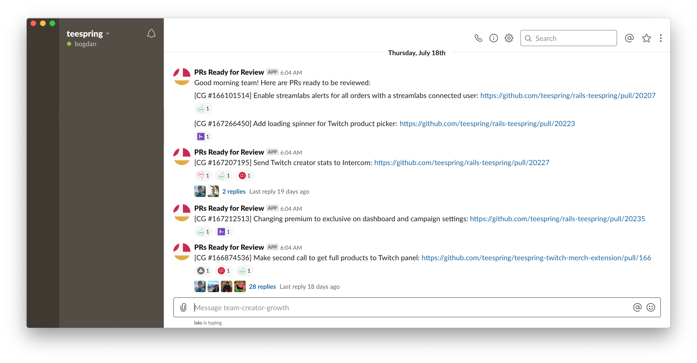
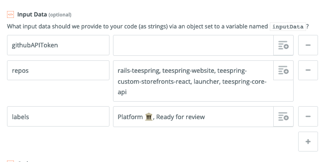

# Zapier-GitHub-Slack "PRbot"

Finds GitHub PRs marked with provided labels and feeds them to Zapier (e.g. to be sent to Slack as bot). At Teespring we use it to make sure we don't lose PRs and to have a place for per-PR discussions on Slack with threads (comments of lasting value are still put on GitHub):

## Configuration
- `githubAPIToken`: required
- `labels`: optional
- `excludeLabels`: optional
- `repos`: required, list of repositories
- `owner`: required, the github account

* Draft PRs are always exclued

### Running locally

1. `npm install`
1. `node getPRs.js`

### Copying to Zapier

See [getPRs.js](getPRs.js)

### Input Data

Provided as zapier input variables, or in the top of getPRs.js

- `githubAPIToken`
- `labels`: comma-separated list of PR labels. For a PR to be sent to Slack it must match ALL the labels
- `repos`: comma-separated list of repos to check for PRs

|like this|
|-|
||
